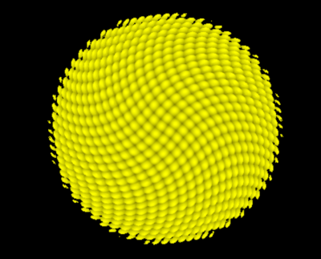
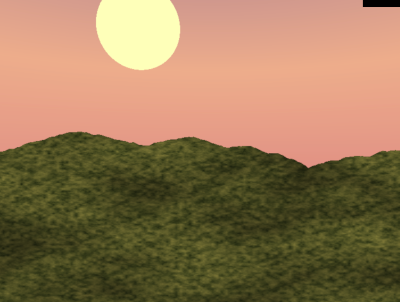

# SDF Sunflowers

By J. Reuben Wetherbee (pennkey: wetherbe)

For CIS 566 Spring 2018 - University Of Pennsylvania


## Introduction
This project explores different techniques to produce a field of collection of sunflowers using a WebGlfragment shader.
In particular the following methods were employed:
- Fractal Bronwnian Motion (FBM): for background color / terrain height
- Signed Distance Functions (SDF): flower geometry
- Color Mapping:  petals / background sky
- Depth of Field:  post processing in ShaderToy to simulate camera focus
- Ligth Bloom:  post processing in ShaderToy to simulate sunlight bloom
- Environmental Lighting:
- Simulation of Soft Based Shadows

## Demos
The demos for this project can be found in two places
- [With Post Processing on Shader Toy](https://www.shadertoy.com/view/tdSGWy)
- [No post processing](https://jrweth.github.io/hw03-environment-setpiece/)  


## SDF Seed Pattern


The seed pattern was created by taking the SDF for a sphere but then displacing the height accoriding to a sine/cosine function. 
This function was then increasingly rotated as the distance from the center increased to give it the the spiral pattern.
````xslt
    float g = 80.0;
    float dist = (0.5 - length(point.xy)) * 2.0;
    mat3 rot = mat3(cos(-dist), -sin(-dist), 0.0,
                    sin(-dist), cos(dist),  0.0,
                    0.0,       0.0,        1.0);
    point = rot * point;
    return (2.0 + abs(sin(point.y * g))+abs(cos(point.x * g)))/4.0;
````

Some "fake" ambient occlusion was added by assigning the color to the "valleys" of the seeds to a color with
less intensity.

## Petal shape: Curved SDF

The petals were created by taking a rounded box SDF (definitions taken from 
[Inigo Quilez](https://www.iquilezles.org/www/articles/distfunctions/distfunctions.htm).  The box was then
adjusted using smooth step to get the pointed end of the petal.  The z-axis was then curved to give it the concave appearance.

## Petal Color

The petal color was created by blending three different colors along the length of the flower, varied slightly with
randomness.  Additional streaks were then added along the x-axis of the petal to give them additional texture.


## Petal Randomness


The petals were then adjusted to have slightly different lengths and curvatures.  Also, the petals were separated
into two rows and the second was set slightly behind the first. 


## Soft Shadow


Shadows were obtained by raymarching toward the sun and finding any occluding objects.  The closest distance
was also found in order to acheive soft-shadowing according to the technique used by Inigq Quirez 
[here](http://www.iquilezles.org/www/articles/rmshadows/rmshadows.htm)).

##Subsurface Scattering

In order to simulate the light passing through the petals when the sun is behind them some subsurface scattering
was used to create translucecy around the petal edges.

## Land Texture


There is no geometry associated with the land texture, but is simply a color applied to the background.
To give it a bit more interest the height of the horizon (or mountain height) was acheived using 2d FBM.
The color of the texture was created by mixing two different colors representing sand and brush and
mixing them together using FBM.

## Background Sky




The change in the sky background as the day progressed was created by createing colors for the following phases
of the day.
- night
- dawn
- noon
- sunset 

For each phase a distinct color was created for the following parts of the sky
- horizon
- middle
- zenith

As the day progresses different weights are assigned to the phases and then the three areas of the sky are mixed accordingly.

## Environmental Lighting
To simulate the environmental lighting 3 lights were set as explained by this
 [article](http://www.iquilezles.org/www/articles/outdoorslighting/outdoorslighting.htm).
 This involves setting up the following three light sources:
 - Sun  ( from sun position )
 - Sky  ( from directly overhead)
 - Reflected Sunlight (from horizon opposite sun)
 
 In the case of this simulation, because the sun is moving across the sky it was necessary to diminish the 
 reflected sunlight at noon otherwise the reflected sunlight jumps immediately from one horizon to the opposite when
 the sun crosses its zenith.
 

## Depth of Field

The depth of field was created as a post processing step in [ShaderToy][https://www.shadertoy.com].  Since the
simulation was using raymarching to determine the pixel color it was trivial to add the distance to the alpha channel
of the color to pass it to the post processing step in ShaderToy.  

The post processing step uses gaussian blur to blur each pixel whose distance is outside of the focal range that is set.
To make things a bit more interesting the focal range changes as the camera moves around the scene so different
sunflowers get highlighted.  The Gaussian blur was based upon the following ShaderToy implementation (https://www.shadertoy.com/view/MtlSWj).


## Sun Bloom

In addition to depth of field, an additional, and very similar, effect was added in order to simulate light bloom.
In this case the main ray was checked to see if it hit the sun SDF.  If it did then the alpha chanel was increased by 1000
to communicate with the post processing step that there should be blur.

In the ShaderToy post processing step, if a pixel was specified as having a bloom, the shader once again used guassian
blur to create the light bloom.


