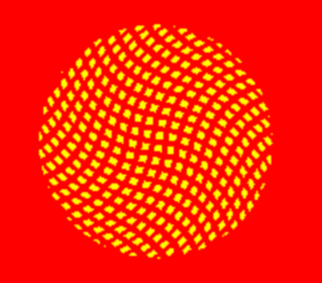

# SDF Sunflower

## CIS 566 Homework 3: Environment Setpiece

## Seed Pattern

The seed pattern 

## Seed Height and Color

## Petal shape: Curved SDF

## Petal Color

## Petal Randomness

## Soft Shadow

## Depth of Field

## Land Texture

## Background Sky

## Sun Bloom

https://www.shadertoy.com/view/MtlSWj
